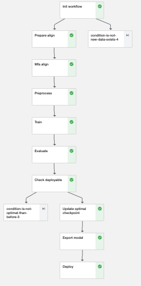
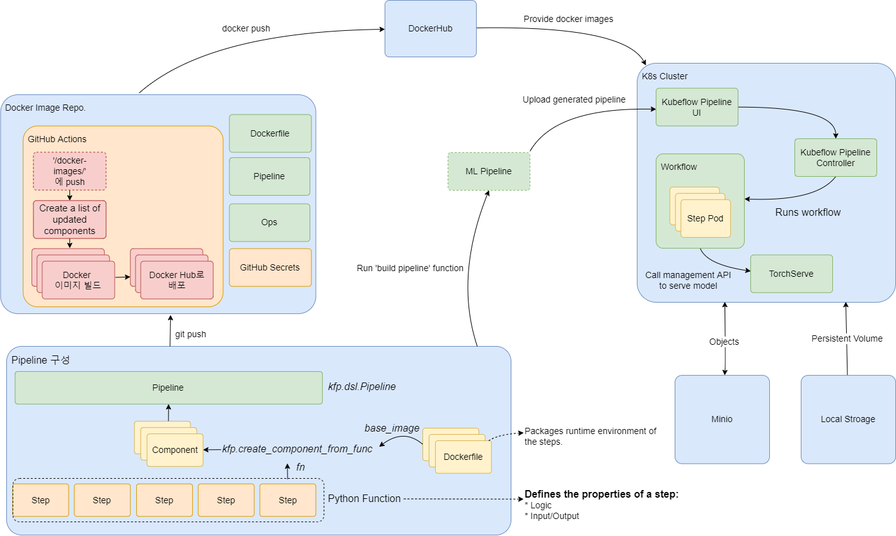

# FastSpeech2 Pipeline

This repostiory contains definition of FastSpeech2 training workflow and CI/CD of docker image. 

A generated workflow could be deployed to Kubeflow and runs pre-processing of data, training and serving a model.

## Pipeline components
* Init workflow: check recently added data exists
* Prepare align: preprocess text and WAV files
* MFA align: generate the textgrids which represent phonemes and durations of the words
* Preprocess: generate features
* Train: train the FastSpeech2 model
* Evaluate: evaluate the trained FastSpeech2 model
* Check deployable: compare the performance between trained model and previously deployed one
* Update optimal checkpoint: save model's attributes (e.g. performance) 
* Export model: archive model as TorchServe MAR
* Deploy: serve the trained model

## Architecture

## Setup Environment
If you cloned this repository, you should set Docker Hub access token and set secret values in your repository secrets to run CI workflow.
Instructions are described at https://docs.docker.com/ci-cd/github-actions/

# References
* Original codes: [AppleHolic/FastSpeech2](https://github.com/AppleHolic/FastSpeech2)
